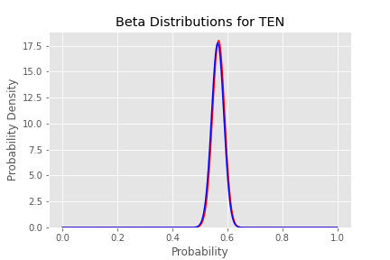
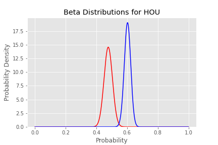

# Passing VS Running Success in the NFL

## The Face of the NFL is Changing
In recent years with the emergence of several young and talented quarterbacks, NFL pundits and coaches have advanced the claim that "This is a passing league". With the success of teams like Green Bay, Tampa Bay, and Kansas City, there is plenty of annecdotal evidence to support this. From a fan standpoint, the modern day high-flying NFL is absolutely captivating and more volitile than ever, but is there statistical evidence to support this league wide shift in offensive philsophy?

  

## Describing the Data
I gathered data from [NFLSavant.com](http://nflsavant.com/about.php) where open source NFL play by play data is stored in CSV format. The data can also be found in the data folder here. The raw data contains about 46,000 rows with over 40 fields of descriptive data. Some significant features includes Yards, Yards Togo, Formation, Play Type, Game ID, and Team Name. Although there are many more, this analysis will focus mostly on using those features. I added a column to the data indicating if the play was a success or not based on [existing metrics](https://www.sharpfootballstats.com/basics-and-faq.html) for success. To summarize, a play is a success on first down if it gains 40% of yards to go for the first down. On second that increases to 60%. On third and fourth down the only way to succeed is to get the first down or touchdown. I cleaned up a few empty columns and adjusted the rush direction column to account for QB scramble plays as well.

## Exploring the Data
I began exploring the data by creating a few functions to help plot one stat against another for each team. All helper functions used for plotting and cleaning the data are in the script folder and utilized in the EDA_Notebook.ipynb file as well. All graphical visualizations for this project and more can be found in their respective categories inside the images folder. For the sake of figuring out wether it is better to pass or run in the NFL, the traditional method for determining success would compare yards against run attempts and pass attempts as seen below.

  
  

Following this comparison, I broke down yards per run and pass further to explore the rate of success of per down. The example below demonstrates how different the two success statistics are by sampling the NFL as a whole. The graph in the center contextualizes the other two by giving an idea of sample size for each down.

  

Another way to vizualize the success of run and pass plays is to at the beta distributions of success rate for a few teams.  

**Top Four Offenses by Total Yards:**

     

The top four offenses differ in offensive philosophy pretty significantly. The two teams on top utilize pass heavy offenses more common to todays game, while the lower two rely on workhorse running backs to propell their offenses.

## Hypothesis Testing  
The goal of this hypothesis testing is to determine if pass plays is more successful than run plays in general and for specific teams.
Null Hypothesis: The rate of success for run plays is less than or equal to the rate of success for pass plays
Alpha = .02 This threshold yields a 98% confidence interval which allows us draw more certain conclusions that could one day factor into a coaches game planning.
Because there are 33 different tests being conducted simultaneously from the same data, our alpha threshold requires a Bonferonni corection of 33, which lowers our threshold of statistical significance to .00061.

**Results:** With a P-Value of .1002, we failed to reject the null hypothesis with respect to the league as a whole. Below is a probability density graph for the difference in proportions of success for rush and pass plays where the shaded region represents the league wide P-Value.

  

Only the Houston Texans managed to reject the null hypothesis with a P-Value of .00028, which is below our adjusted alpha of .00061. The shaded region starts at .12 and is effectively invisible in this graph, giving us visual confirmation of of our statistically significant P-Value.

    

## Conclusion
Of the 33 hypothesis tests conducted above, only one met the signifigance level to reject the null hypothesis. From this frequentist standpoint, there is insufficient evidence in the 2020 NFL season to support the claim that passing is a more successful offense than running. When it comes to the Houston Texans, we can observe that they have a very successful passing game and the second worst ranked run game in the NFL, which helps explain the results. There are some acknowledgements to be made here. The success of run and pass plays were viewed as independent for these tests, despite the fact that run and pass plays build off of eachother in an NFL game. This is hard to adjust for, and may have lead to a bias favoring running plays on third downs and passing plays on first downs. In future analysis, I would like to break down my analys to get a more granular look at the success rates for specific formations, play types, and receiving targets.
